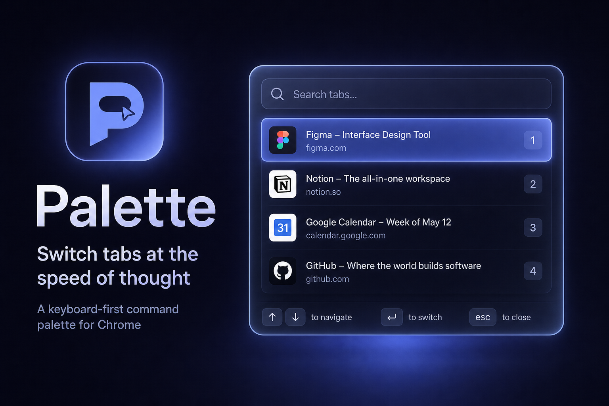

<p align="center">
  
</p>

<h1 align="center">Palette</h1>

<p align="center">A keyboard-first command palette for Chrome — the browser equivalent of VS Code's Quick Open or Raycast.</p>

---

Press **Cmd + J** (**Ctrl + J** on Windows/Linux) anywhere to open a floating palette, type to fuzzy-search your open tabs, and hit **Enter** to jump straight to the one you want (focusing its window automatically if it lives elsewhere). The shortcut is configurable in the settings page.

The MVP does exactly one thing — switch tabs — but it's built on an extensible command architecture so new commands (bookmarks, history, "close tab", AI actions, …) drop in without a rewrite.

---

## Features

- **Instant tab switching** with fuzzy search over title, hostname, and full URL (powered by [Fuse.js](https://www.fusejs.io/)).
- **Intelligent ranking**: exact > prefix > fuzzy, with a recency nudge for tabs you use often.
- **Recent-first default**: with an empty query, tabs are ordered by real recency (Chrome's own `lastAccessed`), most recent first.
- **Hides the current tab**: the tab you're already on is left out of the list, so the top result is the tab you were last on — Enter jumps straight there.
- **Fully keyboard driven**: Arrow keys, Home/End, Enter, Esc — plus mouse click and hover.
- **Cross-window**: switching to a tab in another window brings that window to the front.
- **Move tab to current window**: press **Shift + Enter** (or Shift + click) to pull the selected tab into the window you're in, instead of jumping to it.
- **Fully configurable keys**: set the open shortcut _and_ every in-palette key (navigate, switch, move-here, close) from the settings page (click the toolbar icon), synced via `chrome.storage.sync`.
- **Back/forward through tabs**: **Cmd + ,** goes back to older tabs and **Cmd + .** goes forward (**Ctrl + ,** / **Ctrl + .** on Windows/Linux) — browser-style history navigation over your tab focus order, without opening the palette.
- **Polished UI**: dark theme, rounded corners, soft shadow, blurred backdrop, and fade animations — rendered in a Shadow DOM so no page styles leak in or out.
- **Fast at scale**: the search index is rebuilt only when your tabs change, and rows are memoized, so it stays responsive with hundreds of tabs.

---

## Tech stack

Manifest V3 · TypeScript (strict, no `any`) · React 19 · Vite · `@crxjs/vite-plugin` · Fuse.js · ESLint · Prettier.

---

## Getting started

### Prerequisites

- Node.js 18+
- Google Chrome (or any Chromium browser that supports MV3)

### Install

```bash
npm install
```

### Build

```bash
npm run build
```

This typechecks the project and emits a ready-to-load extension into `dist/`.

### Develop with hot reload

```bash
npm run dev
```

Then load the generated `dist/` directory as an unpacked extension (see below). `@crxjs/vite-plugin` hot-reloads the content script and background worker as you edit.

### Other scripts

| Script              | Description                 |
| ------------------- | --------------------------- |
| `npm run typecheck` | Type-check without emitting |
| `npm run lint`      | ESLint                      |
| `npm run format`    | Prettier (write)            |

---

## Loading the unpacked extension into Chrome

1. Run `npm run build` (or `npm run dev`).
2. Open `chrome://extensions`.
3. Toggle **Developer mode** on (top-right).
4. Click **Load unpacked** and select this project's **`dist/`** folder.
5. Press **Cmd + J** (**Ctrl + J** on Windows/Linux) on any normal web page to open Palette.

### Changing the shortcut

Palette has two independent shortcuts:

- **In-page shortcuts** (open palette + all in-palette keys): handled by the content script, which intercepts chords and suppresses the browser's native action (e.g. Cmd/Ctrl + J's Downloads). Fully configurable from the **settings page** — click the toolbar icon, or right-click it and choose _Options_. The open shortcut requires a modifier; in-palette named keys (arrows, Enter, Esc) can be used bare, while letters need a modifier.
- **Browser-wide command**: managed by Chrome at `chrome://extensions/shortcuts`. Extensions can't change this one programmatically, but it works even on pages where content scripts can't run.
- **Back/forward tab commands** (`Cmd + ,` / `Cmd + .` on macOS, `Ctrl + ,` / `Ctrl + .` elsewhere): walk backward/forward through your tab focus history without opening the palette. A manual tab switch resets the cursor to the most recent tab. These are browser-wide commands, so re-bind them at `chrome://extensions/shortcuts`. **Note:** macOS reserves `Cmd + ,` for Settings, so the "back" command may register unbound — assign it at `chrome://extensions/shortcuts`.

> **Note:** content scripts cannot run on `chrome://` pages, the Chrome Web Store, or other restricted URLs, so the palette won't open while those pages are focused. Switch to a normal tab first.

---

## How it works

```
Cmd/Ctrl+J ──> content-script interceptor / chrome.commands ──> toggle palette
                                   │  (typed RPC + snapshot broadcast)
                                   ▼
                         Content script (Shadow DOM React UI)
                                   │  command registry -> tab provider
                                   │  Fuse.js search + ranking
                                   ▼
                         Enter ──> RUN_ACTION ──> Background
                                   activate tab + focus window + record MRU
```

- The **background service worker** is the single owner of Chrome APIs. It serves typed RPC requests (read a snapshot, run an action) and broadcasts a fresh snapshot to open tabs whenever the tab set changes.
- The **content script** mounts the React UI inside a **Shadow DOM** so the host page's CSS can't interfere. It hosts the **command registry** and renders results.
- The UI never calls Chrome APIs directly — it dispatches serializable **actions** that the background performs.

---

## Project structure

```
src/
  background/      Service worker: Chrome API access, RPC, MRU, snapshot broadcast
    index.ts         Entry: commands, message router, tab-change listeners
    rpc.ts           Typed request handling + action dispatch
    tabsService.ts   Query/activate tabs, focus windows
    mruService.ts    MRU persistence in chrome.storage.local
  content/         Content script that injects the UI
    index.tsx        Shadow DOM mount + React root
    App.tsx          Open/close state, hotkey interception
  options/         Settings page (configurable in-page hotkey)
    index.html, main.tsx, Options.tsx, options.css
  components/      Presentational + composed UI (Palette, SearchInput, ResultList, ResultRow, Badge, Footer)
  hooks/           useTabs, useSearch, useKeyboardNav
  services/        messaging (typed RPC), search (Fuse + ranking), settings (hotkey storage)
  commands/        Extensible command system
    types.ts         CommandProvider / PaletteItem / PaletteAction
    registry.ts      Aggregates providers, merges + ranks results
    providers/       One file per command source (tabProvider)
  types/           Shared cross-boundary types (tab, messages)
  utils/           url parsing, Shadow DOM mounting
  styles/          palette.css (injected into the Shadow DOM)
```

---

## Architectural decisions

- **Shadow DOM overlay (content script), not a popup.** A toolbar popup can't be centered over the page and can't deliver a Spotlight-style experience. Injecting a Shadow DOM overlay gives full control over placement and bulletproof style isolation.
- **Background as the source of truth.** Content scripts can't access `chrome.tabs`. Centralizing all Chrome access in the worker keeps the UI pure, testable, and free of permissions concerns, and makes future commands a matter of adding an action handler.
- **Snapshot push + UI-side search.** The worker pushes a serializable tab snapshot; the UI builds the Fuse index from it. The index is rebuilt only when the snapshot changes (reference equality), so typing never rebuilds it — the key to staying fast at 500+ tabs.
- **Command provider abstraction.** Every result source implements `CommandProvider`. The registry aggregates and ranks across providers, so adding bookmarks/history/AI later is additive, not a refactor.
- **Actions as data.** Side effects are serializable `PaletteAction` objects executed by the worker — a clean, type-safe boundary between "what to do" (UI) and "how to do it" (background).
- **MRU keyed by URL.** Tab ids are unstable across restarts; URLs identify the same destination over time, so recency survives restarts. Stored in `chrome.storage.local`.
- **Strict TypeScript, no `any`.** `exactOptionalPropertyTypes`, `noUncheckedIndexedAccess`, and `strictTypeChecked` ESLint rules are all on. Cross-boundary messages are validated with type guards.

### Permissions

Only what's needed:

- `tabs` — read tab metadata (title, URL, favicon) and activate tabs.
- `storage` — persist the MRU history.

Window focusing uses `chrome.windows.update`, which needs no extra permission. No host permissions are requested beyond the content-script match.

---

## Adding a new command (future)

1. Create a provider in `src/commands/providers/`, implementing `CommandProvider`:

```ts
export function createBookmarkProvider(): CommandProvider {
  return {
    id: 'bookmarks',
    async getItems(query, _context) {
      // fetch via a new RPC, map to PaletteItem[] with an action
      return [];
    },
  };
}
```

2. Register it in `src/commands/registry.ts`.
3. If it needs a new side effect, extend the `PaletteAction` union in `src/commands/types.ts` and handle it in `src/background/rpc.ts`.

No changes to the UI, hooks, or messaging layers are required.

---

## License

[MIT](LICENSE)
